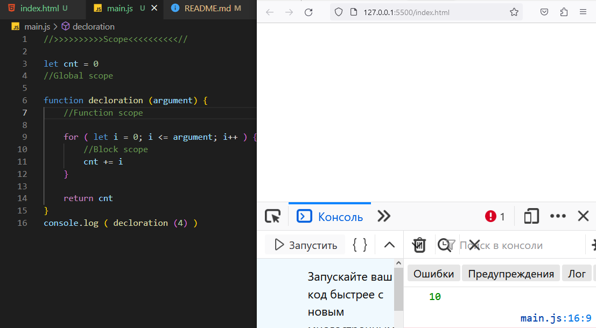
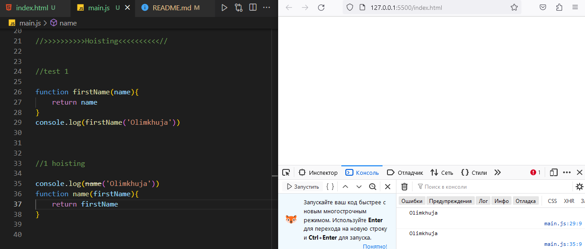
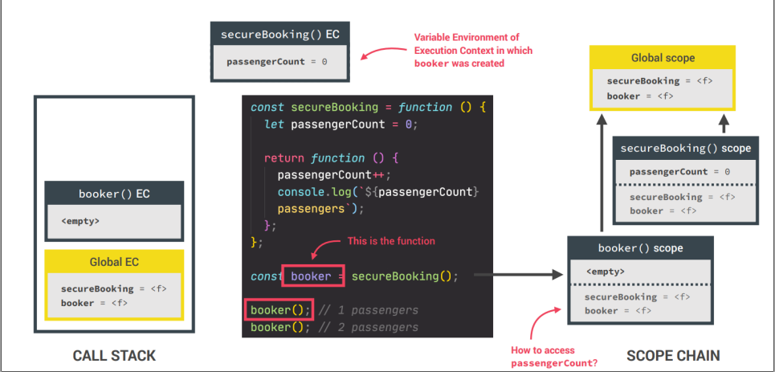

# JS_Lecture2

## Table of Contents
> 1) Scope
> 2) Hoisting
> 3) Recursion
> 4) Closure

## What is Scope in JavaScript?
> Область видимости в JavaScript относится к доступности или видимости переменных и выражений. Это означает пространство, в котором элемент, такой как переменная или функция, виден и доступен в вашем коде. Например, как только переменная объявлена, она может быть доступна только в пределах области, в которой она была объявлена, и не будет доступна за пределами области.
###### JavaScript имеет следующие виды областей
> - Global scope
> - Function scope
> - Block scope
> - Module scope
>
> 

## The scope chain
> 

## What is Hoisting in JavaScript?
> В JavaScript подъем - это поведение по умолчанию, заключающееся в перемещении всех объявлений в верхнюю часть области видимости перед выполнением кода. По сути, это дает нам преимущество в том, что независимо от того, где объявлены функции и переменные, они перемещаются в верхнюю часть своей области, независимо от того, является ли их область глобальной или локальной.
> 
###### Temporal Dead Zone, let and const
> 

## What is Recursion in JavaScript
> Рекурсия - это когда функция вызывает саму себя до тех пор, пока кто-то не остановит ее. Если никто не остановит его, то он будет
повторяться (вызывать сам себя) вечно. Рекурсивные функции позволяют выполнять единицу работы несколько раз.
В современных языках программирования, таких как JavaScript, уже есть операторы for и while в качестве
альтернатив рекурсивным функциям. Но в некоторых языках, таких как Closure, нет никаких
операторов цикла, поэтому вам нужно использовать рекурсию для повторного выполнения фрагмента кода
>
> - Рекурсивная функция должна иметь условие для прекращения вызова самой себя. В противном случае функция вызывается бесконечно.
> - Как только условие выполняется, функция перестает вызывать саму себя. Это называется базовым условием.
> - Чтобы предотвратить бесконечную рекурсию, вы можете использовать оператор if...else (или аналогичный подход) где одна ветвь выполняет рекурсивный вызов, а другая - нет

## What is Closure in JavaScrip?
> Закрытие - это функция JavaScript, которая позволяет внутренним функциям получать доступ к их внешней области видимости. Замыкание помогает привязать функцию к ее внешней границе и создается автоматически всякий раз, когда создается функция. Начиная с ES6, блок также рассматривается как область видимости. Поскольку JavaScript управляется событиями, замыкания полезны, поскольку помогают поддерживать состояние между событиями
> 
>
>
> 

